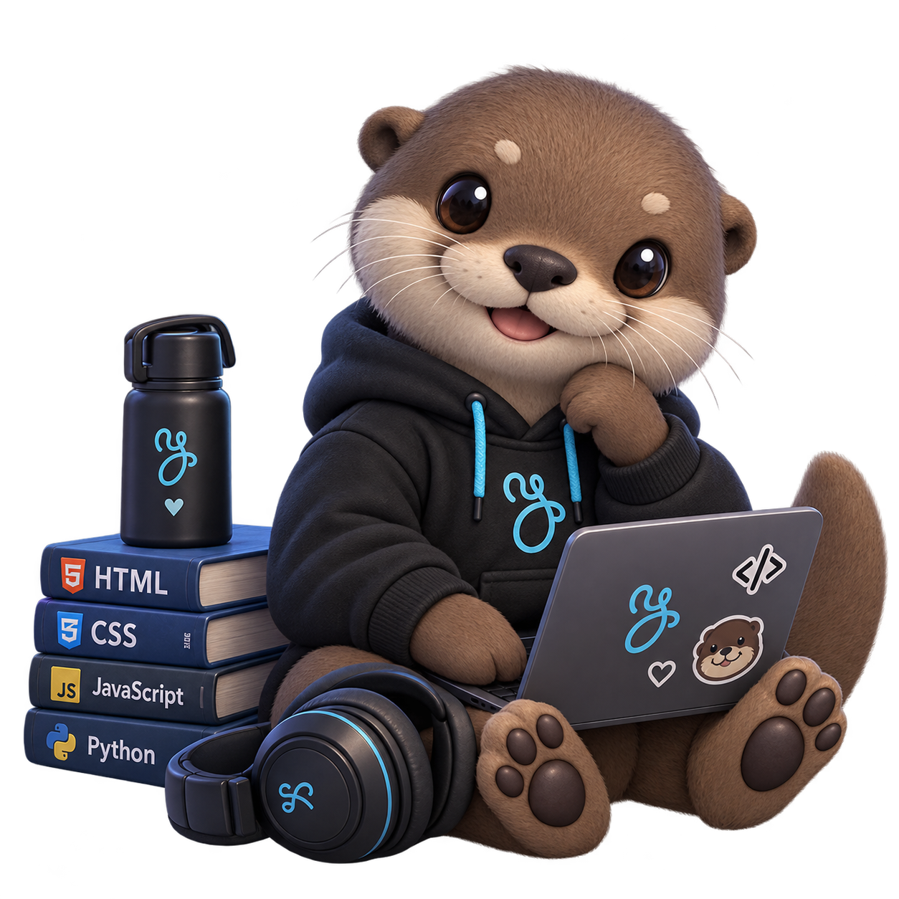

<a href="https://git.io/typing-svg">

 

---

## 👩‍💻 About me

I'm just a girl studying programming who wants to create things that look good and work even better. I move between **web design and development** and **game creation**, and I'm drawn to projects that make me think hard (yeah, the ones that give me a little headache 😅).

- 🔭 **Currently learning:** Python, JavaScript and C#
- 🌱 **Interested in:** web design, game development and solving tricky problems
- 📚 **Outside of code:** reading and sleeping (yes, in that order of priority)
- 🦦 **Fun fact:** I think it's pretty obvious I love otters

 

---

## 🛠️ Stack & tools

---

## 🚀 Featured projects

| Project | Description | Tech |
|:--|:--|:--|
| 🎮 **[Cutie's Finder](https://github.com/andreebueno03/tu-repo)** | A little game where you steal the adorable things you come across at your job | `C#` `Unity` |
| 🌐 **[MorphoMobile](https://andreeby.itch.io/morphomobile)** | An Anatomy and Pathology simulator in Spanish designed to help medical students | `HTML` `CSS` `JavaScript` |
| 🐍 **[Inventory Control](https://github.com/andreebueno03/tu-repo)** | Inventory control system for the healthcare field | `Python` |

---

## 📊 GitHub activity

<!--  -->

---

## 🎯 Goals for this year

- [x] Pass my university thesis
- [ ] Finish my first complete video game
- [ ] Publish my web portfolio
- [ ] Contribute to an open source project
- [ ] Master the fundamentals of JavaScript and C#

<!-- Mark items with [x] as you complete them. Seeing your progress looks great! -->

---

## 📫 Let's talk

  

🦦 *Made with hate (jk)* 🦦

  
</a>

 

---

## 👩‍💻 About me

  

 

I'm just a girl studying programming who wants to create things that look good and work even better. I move between **web design and development** and **game creation**, and I'm drawn to projects that make me think hard (yeah, the ones that give me a little headache 😅).

- 🔭 **Currently learning:** Python, JavaScript and C#
- 🌱 **Interested in:** web design, game development and solving tricky problems
- 📚 **Outside of code:** reading and sleeping (yes, in that order of priority)
- 🦦 **Fun fact:** I think it's pretty obvious I love otters

---

## 🛠️ Stack & tools

---

## 🚀 Featured projects

| Project | Description |
|:--|:--|
| 🎮 **[Cutie's Finder](https://github.com/andreebueno03/tu-repo)** | A little game where you steal the adorable things you come across at your job `C#` `Unity` |
| 🌐 **[MorphoMobile](https://andreeby.itch.io/morphomobile)** | An Anatomy and Pathology simulator in Spanish designed to help medical students `HTML` `CSS` `JavaScript` |
| 🐍 **[Inventory Control](https://github.com/andreebueno03/tu-repo)** | Inventory control system for the healthcare field `Python` |

---

## 📊 GitHub activity

<!--  -->

---

## 🎯 Goals for this year

- [x] Pass my university thesis
- [ ] Finish my first complete video game
- [ ] Publish my web portfolio
- [ ] Contribute to an open source project
- [ ] Master the fundamentals of JavaScript and C#

<!-- Mark items with [x] as you complete them. Seeing your progress looks great! -->

---

## 📫 Let's talk

  

🦦 *Made with hate (jk)* 🦦

